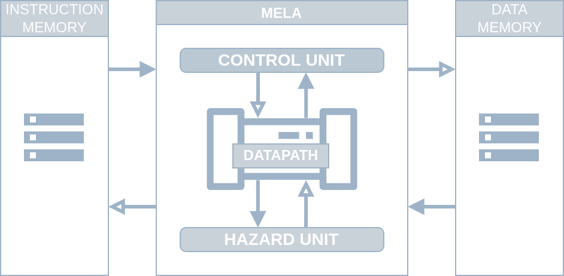
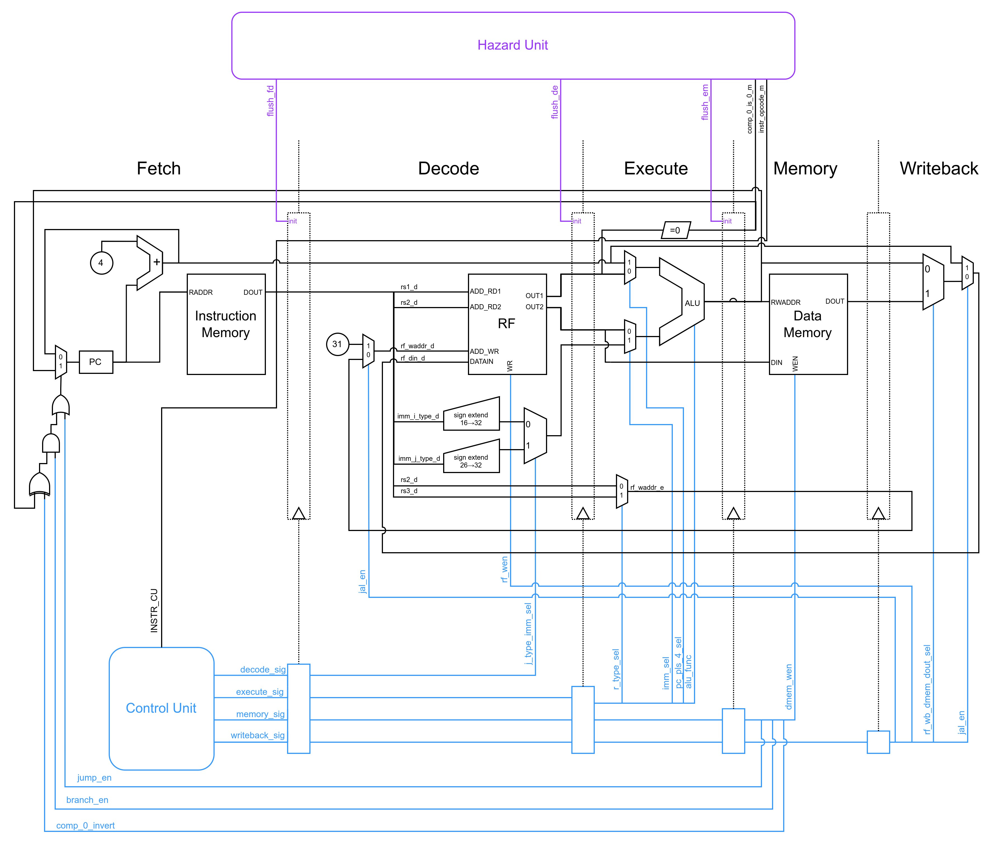
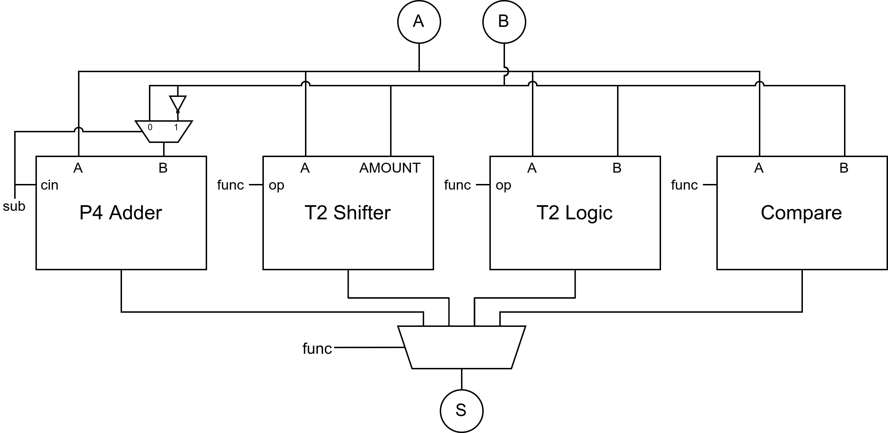
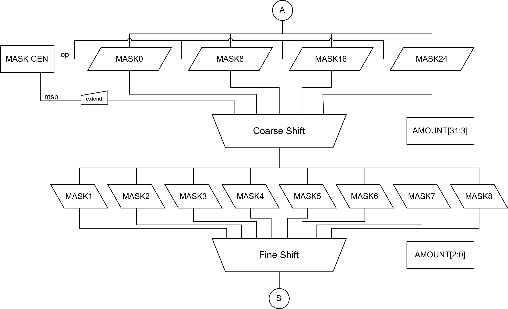
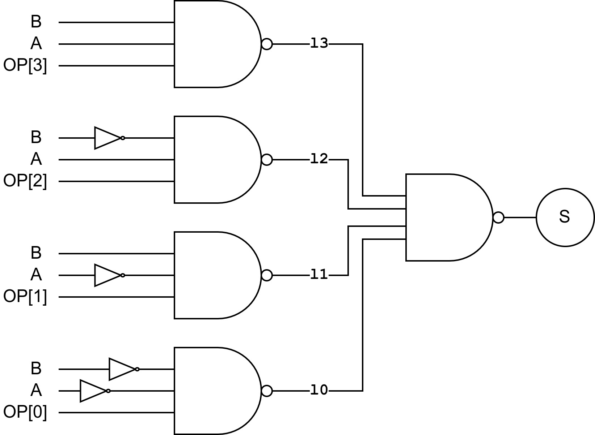
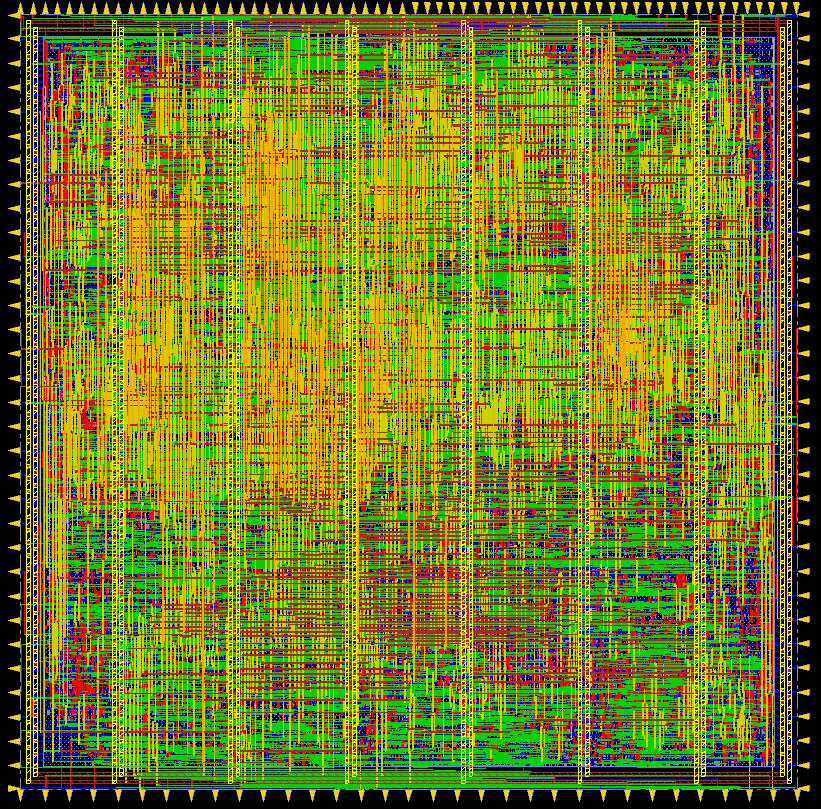
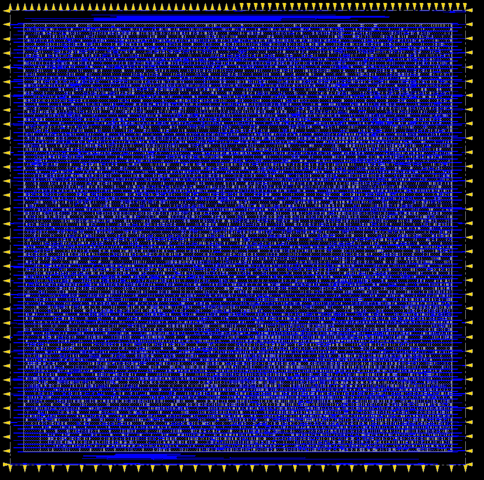
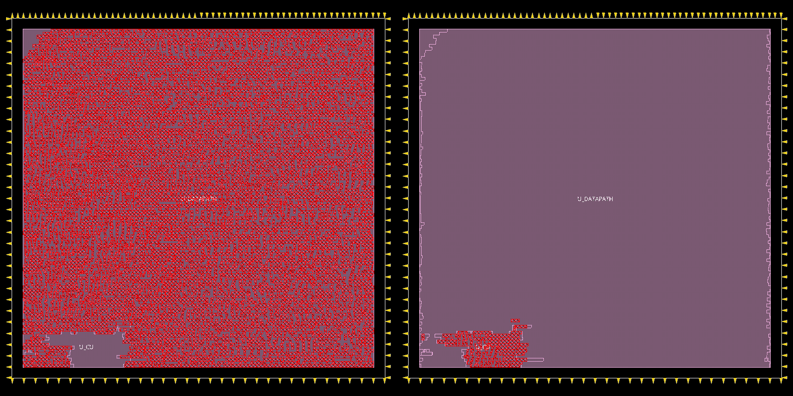
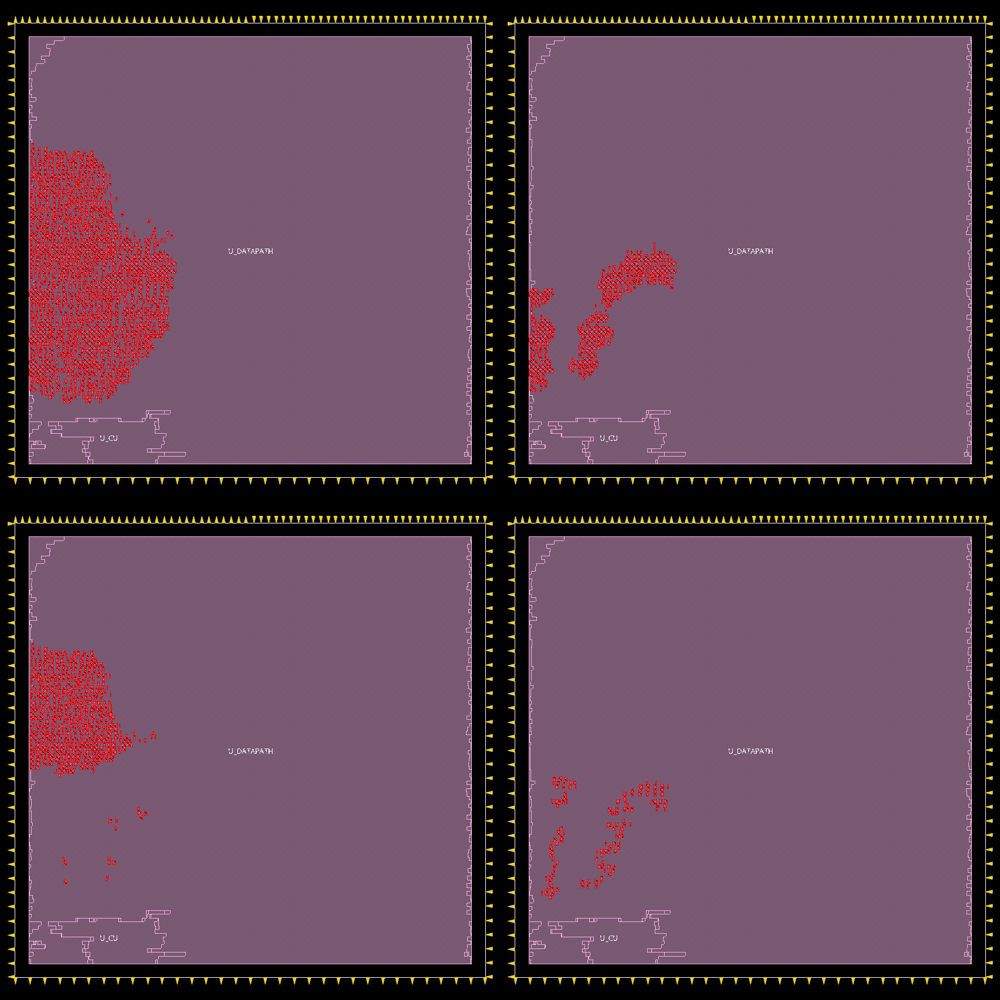

# MELA: a Modestly Exhaustive dLx Architecture
```
                                             .:'
                                            __ :'__
                                         .'`  `-'  ``.
                                        :             :
                                        :             :
                                         :           :
                                          `.__.-.__.'

```
----

### Author Note
> I don't like this folder structure but it was imposed on us to keep the project "tidier" and simpler to recognize the hierarchy from. To be honest the constraint is understandable but it's still awful to look at and use.

## Block Level Overview

As can be seen in the block schema of the processor, data and instruction memories are placed outside the CPU.

## Data-path
The data-path is represented in black, the control unit and its signals are blue and the hazard unit is purple.


## ALU
The ALU features a Pentium 4 adder unit, a UltraSPARC T2 Shifter and Logic units and a behavioural comparator unit.


### T2 Shifter
The shifter unit is based on the SUN UltraSPARC T2 design, with a three-stage
shifter implemented using masks shifted by varying amounts and combined to obtain
the required operation. The implemented unit is able to perform left and right
logical shifts and right arithmetical shifts.

#### Mask Generator
The mask generator generates four masks, that contain the
input A signal shifted by 8, 16, 24 and 32 bits respectively. The shift direction is
dictated by the op signal (`00` for logical left shift, `01` for logical right shifts and
`10` for arithmetical right shifts). An additional signal, msb, generates a fifth mask
that is used for AMOUNT values greater than 31. The value of msb is `0` when a
logical shift is being performed and is equals to the most-significant bit of A when
an arithmetic shift is selected.
#### Coarse Shift
The coarse shift stage selects the coarse mask by considering the 30
most-significant bits of the AMOUNT signal. If AMOUNT is bigger than 31, the
coarse shift will select the msb mask.
#### Fine Shift
The fine shift will shift the selected coarse mask by the three least-
significant digits of AMOUNT , completing the shift operation

### T2 Logic Unit
The T2 logic unit is able to perform five logical operations with just five NAND gates.


## Dependencies
- Questa Sim-64 10.7c
- design compiler F-2011.09-SP3
- Bash
- Perl

## How To Run An Assembly Program
1) Write an Assembly program using the DLX isa found [here](./doc/isa.md)
   1) The size of your program (lines of code), must be so that it could be saved in the instruction memory. If your program exceeds this size the design will not compile, in such case change the value `C_IMEM_ADDR_W` in file `./src/000-common.core/000-DLX_PKG.vhd` accordingly.
   2) If you need to address more then the default data-memory space change the variable 
   `C_DMEM_ADDR_W` in file `./src/000-common.core/000-DLX_PKG.vhd` accordingly. The compiler can't catch this error, the design will simulate your design but will truncate the data-memory-addresses to comply with its internal address space.

2) Run the assembler on the assembly program and link the output to the instruction memory ram-file
   ```bash
   ./scripts/assembler/assembler.sh <path_to_your>.asm ./src/000-common.core/003-IMEM_INIT_FILE.txt
   ```
   1) If you want to initialize the data-memory with a ram-file the link it to `./src/000-common.core/004-DMEM_INIT_FILE.txt`:
      ```bash
      ln -s <your_dmem_ram_file>.txt ./src/000-common.core/004-DMEM_INIT_FILE.txt
      ```
      The file must contain 32 bit, hexadecimal, newline escaped values

3) Compile the design (this script assumes vsim is in the system `$PATH`)
   ```bash
   ./scripts/build.sh
   ```

4) Run the simulation, it will run for 212us. (this script assumes vcom is in the system `$PATH`)
   ```bash
   ./scripts/build.sh sim
   ```
   To change the simulation time modify the line `run 212us` in `./sim/sim.do`

5) The simulation will output the file `./sim/rf_dmemd.dump`. This file contains the content of the Register file (in order 0 to 31) and data memory (in reverse order `DATA_MEM_SIZE-1 downto 0`). Check this file to see if your program is compliant with your behaviour (you obviously need to save the program state either in data memory of in the register file)

## How To Syntesize The Design
The design synthesized is only MELA without memories.  
There are 5 available configurations of this design:
1) Full behavioural ALU.
   - design name: `CFG_CPU_BEHAV`
2) Behavioural ALU but LogicalUnit is UltraSPARK T2 LogicalUnit. 
   - design name: `CFG_CPU_BEHAV_ALU_T2LOGIC`
3) Behavioural ALU but Shifter is UltraSPARK T2 Shifter.
   - design name: `CFG_CPU_BEHAV_ALU_T2SHIFTER`
4) Behavioural ALU but adder is Intel Pentium4 adder. 
   - design name `CFG_CPU_BEHAV_ALU_P4ADDER`
5) ALU made of all the previous components but with behavioural comparators. 
   - design name: `CFG_CPU_BEHAV_ALU_STRUCT`

Select the configuration and the desired clock-period in nanoseconds (can be a float value) and run (the script assumes `dc_shell-xg-t` (design compiler) is in your systems `$PATH`):

```bash
./scripts/build.sh syn <design_name> <clock_period_ns>
```

Synthesis outputs will be in the `./syn` folder, respectively:
- `./syn/reports` will contain timing, area and power reports
- `./syn/netlists` will contain the synthesized netlist
- `./syn/design_compiler_sdc` will contain the `sdc` file generated by design compiler for this synthesis run

## Place And Route
Here some nice pictures. No description for this process because we didn't know what we where doing, just following a recipe, but nice pics.  
### ASIC View
|All metal layers                                                      | Transistor cells                                              |
|----------------------------------------------------------------------|---------------------------------------------------------------|
|                  ||
|The pads on the perimeter are Data Memory and Instruction Memory ports|                                                               |

### Space used: Data Path vs Control Unit


### Space used: whole ALU vs P4 Adder vs T2 Shifter vs T2 Logic


## Notes 
I don't like this folder structure but it was imposed on us to keep the project "tidier" and simpler to recognize the hierarchy from. 
To be honest the constraint is understandable but it's still awful to look at and use.

## ALU
MELA's ALU features a Pentium 4 adder unit, UltraSPARC T2 Shifter and Logic units, and a behavioural comparator. The ALU can be configured to have behavioural implementations of the aforementioned units.


For more info about MELA's architecture, check out the [report](doc/report.pdf)

## Nerd corner
### Vim bindings
Make sure the vim `PWD` is the root of the project
```
# compile the asm file open in the current buffer
:nnoremap <F4> :!./scripts/assembler/assembler.sh % ./src/000-common.core/003-IMEM_INIT_FILE.txt<cr>
# save all buffers and push to remote
:nnoremap <F5> :wa<cr>:! rsync -hh -a --info=stats1,progress2 --partial /home/simone/Documents/00.PoliTO/1.2-MicroElectronic-Systems/DLX/ ms_polito:~/dlx_simone<cr>
# compile on remote
:nnoremap <F6> :! ssh ms_polito "cd ./dlx_simone; ./scripts/build.sh"<cr>
```

